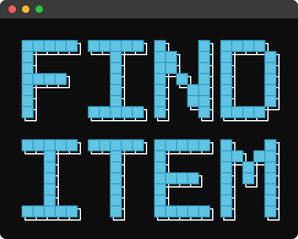
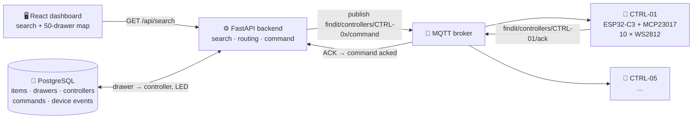

<div align="center">



# FindItem · 寻物

**Search a part. The right drawer lights up.**

[](https://github.com/HarryXin0919/FindItem/actions/workflows/ci.yml)
[](./LICENSE)


[English](#english) · [中文](#中文)

</div>

---

## English

> **Status — software validated, hardware bring-up not yet done.**
> The backend, frontend, MQTT contract and a five-node simulator are complete and
> tested end to end (178 backend tests, a 50-route matrix, and firmware that
> compiles for all five controller identities). **No physical controller has been
> brought up yet.** Nothing in this repository should be read as a claim that the
> hardware has been validated.

### What it does

Fifty drawers, five controllers, one search box. You type a part name on the web
dashboard; the backend resolves it to a drawer, routes the drawer to the
controller that owns it, and publishes a locate command over MQTT. Exactly one
WS2812 pixel lights up — the one in front of your part.

Built for makerspaces, labs and robotics teams, where "which drawer is it in?" is
a daily question.

### Architecture

```
(ESP32-C3 + MCP23017 + 10 × WS2812) × 5  =  50 addressable drawers
```

Five identical nodes rather than one big controller or fifty tiny ones: wiring
stays in manageable groups, only five Wi-Fi clients need provisioning, and a
failed node costs you ten drawers instead of the whole cabinet. The reasoning is
written down in [ADR-001](docs/adr/ADR-001-five-controllers.md).

| Controller | Drawers | Local LED index |
|---|---|---|
| CTRL-01 | 1–10 | 0–9 |
| CTRL-02 | 11–20 | 0–9 |
| CTRL-03 | 21–30 | 0–9 |
| CTRL-04 | 31–40 | 0–9 |
| CTRL-05 | 41–50 | 0–9 |

### How it works



The drawer→controller mapping is a single formula, used by the seed, the router,
the simulator and the firmware alike:

```python
controller = (drawer - 1) // 10 + 1     # 1..5
led_index  = (drawer - 1) %  10         # 0..9
```

There is deliberately no broadcast path. A controller id is validated at one
choke point that rejects wildcards, `all`, and unknown ids, so "light every
drawer" is not expressible.

### Repository layout

| Path | What |
|---|---|
| `backend/` | FastAPI app — search, routing, command service, MQTT contract, 178 tests |
| `firmware/` | **One** ESP32-C3 sketch, five identities via `-DFINDIT_CONTROLLER_INDEX=1..5` |
| `frontend/` | React + Vite dashboard: search, 50-drawer map, 5 controller status cards |
| `simulator/` | Five-node / fifty-LED simulator speaking the same MQTT contract as the firmware |
| `hardware-tests/` | Incremental bring-up sketches, serial baseline → complete node → five-node |
| `docs/` | Firmware architecture, provisioning, wiring, debugging, deployment, ADR, diagrams |
| `legacy-v1/` | The previous single-device prototype (LED + buzzer), including both Java backends. Frozen but still built by CI — see [legacy-v1/README.md](legacy-v1/README.md) |

### Quick start

Everything below runs with **no hardware attached** — `device_mode` defaults to
`simulator`, so the five controllers run inside the backend process.

```bash
# 1. PostgreSQL
docker compose -f docker-compose.postgres.yml up -d

# 2. Backend (first time)
cd backend
python -m venv .venv
.venv/Scripts/python.exe -m pip install -r requirements.txt
.venv/Scripts/python.exe -m app.seed          # 5 controllers, 50 drawers, 12 items

# every time
.venv/Scripts/python.exe -m uvicorn app.main:app --port 8000

# 3. Frontend
cd frontend
npm install
npm run dev                                    # http://localhost:5173
```

On Windows, `.\scripts\start-all.ps1` does all three.

### Checks

```bash
cd backend && pytest                           # 178 tests, needs PostgreSQL
python simulator/test_routing_matrix.py        # 50-route matrix, no dependencies
cd frontend && npm run build
```

Firmware, once per identity:

```bash
cd firmware
arduino-cli compile --fqbn esp32:esp32:esp32c3 \
  --build-property "compiler.cpp.extra_flags=-DFINDIT_CONTROLLER_INDEX=1" \
  FindIt_Controller_Node
```

> **The build flag is not optional.** Omitting it silently builds CTRL-01,
> because the index defaults to 1. After flashing, read the serial banner and
> confirm the printed topic names the controller you meant.

### What has actually been verified

| Claim | Evidence |
|---|---|
| 50 drawers route correctly | 50-route matrix, 223 checks, 0 cross-controller activations |
| Search is deterministic | four typed outcomes — found / ambiguous / not_found / unlocated; it never guesses |
| Topology cannot drift | enforced by PostgreSQL `CHECK`/`UNIQUE` constraints and by config validators, not by convention |
| Idempotency | replaying a `command_id` publishes nothing and creates no second row |
| One source, five identities | all five images compile; each contains only its own four MQTT topics and no other controller's |
| No credentials in the repo | `Secrets.h` is git-ignored; every built image contains `REPLACE_LOCALLY` |
| End-to-end loop | search → locate → simulated controller → ACK, for all 50 drawers |

### What has *not* been verified

- **No physical ESP32-C3 has been brought up.** No Wi-Fi association, no broker
  connection from a device, no LED has been lit by real hardware.
- **Locate latency is unmeasured.** It is not stated anywhere as a number.
- The simulator acknowledges synchronously; a real broker will not. The UI must
  not assume an instant `acked`.

### Provisioning

Copy the template and fill it in locally — it is git-ignored and must never be
committed:

```bash
cp firmware/FindIt_Controller_Node/Secrets.h.example \
   firmware/FindIt_Controller_Node/Secrets.h
```

Per-node provisioning records live in `firmware/controller_configs/CTRL-0x.json`
(identity, drawer range, resolved topics, build flag, pin baseline — no
credentials). Full procedure: [docs/CONTROLLER_PROVISIONING.md](docs/CONTROLLER_PROVISIONING.md).

### License

MIT — see [LICENSE](./LICENSE).

---

## 中文

> **状态 —— 软件已验证，硬件尚未联调。**
> 后端、前端、MQTT 契约和五节点模拟器已完整实现并端到端测试（178 个后端测试、
> 50 条路由矩阵、固件五个身份全部编译通过）。**尚未点亮任何一块真实控制器。**
> 本仓库中的任何内容都不应被理解为「硬件已验证」。

### 它做什么

50 个抽屉、5 个控制器、一个搜索框。你在网页里搜零件名，后端把它解析成抽屉号，
再路由到拥有这个抽屉的控制器，通过 MQTT 下发定位命令 —— 只有一颗 WS2812 会亮，
就在你要找的那个抽屉前面。

面向创客空间、实验室和机器人战队：「这东西在哪个抽屉？」是每天都要问的问题。

### 架构

```
(ESP32-C3 + MCP23017 + 10 × WS2812) × 5  =  50 个可寻址抽屉
```

选五个相同节点，而不是一个大控制器或五十个小节点：布线保持在可管理的分组内，
只需要给五个 Wi-Fi 客户端做配置，而且单节点故障只影响十个抽屉而非整个柜子。
理由写在 [ADR-001](docs/adr/ADR-001-five-controllers.md)。

抽屉到控制器的映射是**唯一一条公式**，seed、路由服务、模拟器和固件共用：

```python
controller = (drawer - 1) // 10 + 1     # 1..5
led_index  = (drawer - 1) %  10         # 0..9
```

系统里刻意没有广播通路。控制器 ID 在唯一的校验入口被检查，拒绝通配符、`all`
和未知 ID，所以「点亮所有抽屉」这个操作根本无法表达。

### 目录结构

`backend/`（FastAPI + PostgreSQL，178 个测试）、`firmware/`（**一套**源码五个身份）、
`frontend/`（React + Vite）、`simulator/`（与固件共用同一份契约模块）、
`hardware-tests/`（逐级 bring-up 草图）、`docs/`（固件架构、配置、接线、调试、ADR、图纸）。

`legacy-v1/` 是上一代单设备原型（LED + 蜂鸣器），含两个 Java 后端 —— 已冻结但 CI
仍在编，避免烂掉。它整个目录一起保留是因为内部路径都相对于**它自己的**根：Java 后端
用 `../config/items.json` 和 `../frontend/index.html` 定位，若把它留在仓库根目录，
`../frontend/index.html` 会静默指到 v2 的 React 外壳。详见
[legacy-v1/README.md](legacy-v1/README.md)。

### 快速开始

下面全部**不需要接硬件** —— `device_mode` 默认是 `simulator`，五个控制器跑在
后端进程内。

```bash
# 1. PostgreSQL
docker compose -f docker-compose.postgres.yml up -d

# 2. 后端（首次）
cd backend
python -m venv .venv
.venv/Scripts/python.exe -m pip install -r requirements.txt
.venv/Scripts/python.exe -m app.seed          # 5 控制器 + 50 抽屉 + 12 个物品

# 每次
.venv/Scripts/python.exe -m uvicorn app.main:app --port 8000

# 3. 前端
cd frontend
npm install
npm run dev                                    # http://localhost:5173
```

Windows 上 `.\scripts\start-all.ps1` 一把起全部。

### 烧录固件

```bash
cd firmware
arduino-cli compile --fqbn esp32:esp32:esp32c3 \
  --build-property "compiler.cpp.extra_flags=-DFINDIT_CONTROLLER_INDEX=1" \
  FindIt_Controller_Node
```

> **这个编译标志不能省。** 漏传会静默编成 CTRL-01（index 默认为 1），编译期守卫
> 只拦 1–5 之外的值，拦不住「漏传」。烧完请看串口 banner，确认打印出来的 topic
> 是你想要的那个控制器。

凭据永远不进仓库：把 `Secrets.h.example` 复制成 `Secrets.h`（已 gitignore）在本地填写。
每个节点的配置记录在 `firmware/controller_configs/CTRL-0x.json`（身份、抽屉范围、
解析好的 topic、编译标志、引脚基线，**不含任何凭据**）。完整流程见
[docs/CONTROLLER_PROVISIONING.md](docs/CONTROLLER_PROVISIONING.md)。

### 尚未验证的部分

- **没有点亮过任何真实的 ESP32-C3。** 没有 Wi-Fi 关联、没有设备侧 broker 连接、
  没有真实硬件点亮过 LED。
- **定位延迟未测量**，因此任何地方都没有写延迟数字。
- 模拟器是同步 ACK 的，真实 broker 不会 —— UI 不能假设 `acked` 会瞬间返回。

### 许可

[MIT](./LICENSE) © 2026 Harry Xin（[@HarryXin0919](https://github.com/HarryXin0919)）
